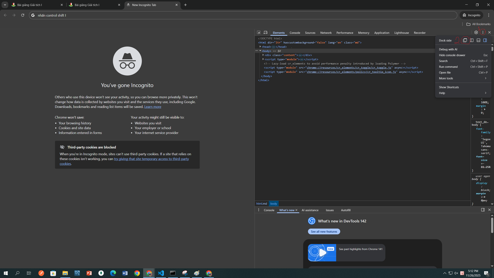

# Hust Ebook Downloader

A Python script to download ebooks from nxbbachkhoa.vn and convert them to PDF format.

## Features

- Automatically extracts book information from the website
- Downloads all pages of an ebook as images
- Merges downloaded images into a single PDF file
- Handles authentication with cookie-based login
- Configurable options for download and conversion process
- Automatic cleanup of temporary files
- Support for Vietnamese text processing

## Prerequisites

Before running the script, you need:

- Python 3.0 or higher
- Dependencies listed in [requirements.txt](requirements.txt)

## Setup Instructions

1. Clone or download this repository

```bash
git clone https://github.com/Mashirochi/download_ebook_nxb_hust.git
```

2. Ensure you have Python 3 installed on your system
3. Install the required dependencies using one of these methods:

### Method 1: Using requirements.txt

```bash
pip install -r requirements.txt
```

### Method 2: Manual installation

```bash
pip install requests Pillow beautifulsoup4
```

## Usage

1. Configure the script by editing the variables in [variable.py](variable.py):

   - Set the `book_url` to the URL of the book page on nxbbachkhoa.vn
   - Extract and set cookie values (GA, VISITOR, ANTIFORGERY, AUTH, GA_TRACK) from your browser:

     

     1. Open Developer Tools → Application → Cookies → `https://nxbbachkhoa.vn/`
     2. Copy the values for each cookie:
        - `_ga`
        - `visitorId`
        - `.AspNetCore.Antiforgery.PAnxZgrQbk8`
        - `auth`
        - `_ga_HFDYKEJJ3N`

2. Run the script:

```bash
python main.py
```

3. The script will automatically:
   - Extract book information
   - Download all pages as images
   - Merge images into a PDF file
   - Clean up temporary files

## Configuration Options

In addition to the variables in [variable.py](variable.py), you can also customize these options by editing [main.py](main.py):

- `DOWNLOAD_IMAGE`: Set to False if you already have images and only want to create PDF
- `SHOULD_MERGE_TO_PDF`: Enable/disable PDF merging
- `DELETE_FOLDER_AFTER_MERGE`: Enable/disable deletion of image folder after PDF creation
- `ENABLE_FAILED_IMAGE`: Handle failed image downloads (False stops after 5 consecutive failures)
- `DEBUG_PROGRAM`: Keep temporary files for debugging
- `CONVERT_FILE_NAMES_TO_SLUG`: Convert PDF filenames to URL-friendly slugs

## Legacy Version

If you encounter issues with automatic parameter detection, you can try the legacy version located in the [legacy/](legacy/) folder which provides detailed instructions for manually extracting all required parameters:

1. Navigate to the legacy folder:

```bash
cd legacy
```

2. Follow the detailed setup instructions in [README-legacy.md](README-legacy.md) to configure:

## Setup Legacy Instructions

### Step 1: Get Authentication Cookies

You need to extract authentication cookies from your browser after logging into `nxbbachkhoa.vn`:


1. Open Developer Tools → Application → Cookies → `https://nxbbachkhoa.vn/`
2. Copy the values for each cookie:
   - `_ga`
   - `visitorId`
   - `.AspNetCore.Antiforgery.PAnxZgrQbk8`
   - `auth`
   - `_ga_HFDYKEJJ3N`

### Step 2: Find the Book URL (buoc_0.png)

Before you can download a book, you need to identify its base URL. Follow these steps:



1. Navigate to the book you want to download on `nxbbachkhoa.vn`
2. Open the book and go to the first page
3. Open Developer Tools in your browser (usually F12)
4. Go to the Network tab
5. Reload the page or go to the next page
6. Look for image requests in the Network tab
7. Identify the URL pattern for the book pages

### Step 3: Extract Base URL

From the image URLs you found in Step 2, extract the base URL:

- Example URL: `https://reading.nxbbachkhoa.vn/doc-sach/502b30d4-bf8e-41c2-a917-78701b9f2847/files/mobile/1.jpg?231108171815`
- Base URL: `https://reading.nxbbachkhoa.vn/doc-sach/502b30d4-bf8e-41c2-a917-78701b9f2847/files/mobile`
- Book ID (id_sach): `231108171815` (the part after the `?` in the image URL)

### Step 4: Watch the Tutorial Video

For a detailed walkthrough of the setup process, watch the tutorial video:

[](https://www.youtube.com/watch?v=DkWVS0xz96k)

_Note: The tutorial video is available in the assets folder as [cach_lay_base_url.mp4](asset/cach_lay_base_url.mp4) but is quite large. For a better experience, we recommend uploading it to YouTube and replacing VIDEO_ID with your video's ID._

3. Run the legacy script:

```bash
python main-legacy.py
```

## Contributing

Contributions to Hust Ebook Downloader are welcome and highly appreciated. However, before you jump right into it, we would like you to review our [Contribution Guidelines](CONTRIBUTING.md) and [Code of Conduct](CODE_OF_CONDUCT.md) to make sure you have a smooth experience contributing to this project.

### Good First Issues

We have a list of [good first issues](https://github.com/Mashirochi/download_ebook_nxb_hust/issues?q=is%3Aissue+is%3Aopen+label%3A%22good+first+issue%22) that contain bugs that have a relatively limited scope. This is a great place for newcomers and beginners alike to get started, gain experience, and get familiar with our contribution process.

## Output

The final PDF will be saved in the root directory with either:

- A slugified version of the book title (if available)
- The default name "result.pdf"

Temporary image files are stored in the `img/` folder during processing and are deleted after PDF creation (unless configured otherwise).

## Troubleshooting

- If downloads fail, check your authentication cookies
- Make sure the `book_url` is correct
- Ensure you have enough disk space for the images and PDF
- Check your internet connection if downloads are slow or failing

## License

This project is licensed under the Creative Commons Attribution-NonCommercial 4.0 International License - see the [LICENSE](LICENSE) file for details.

## Disclaimer

> This script is intended strictly for **personal and educational use only**.  
> Please ensure that you comply with all applicable copyright laws, intellectual property rights, and the Terms of Service of **`nxbbachkhoa.vn`** when accessing or downloading any content.
>
> Unauthorized reproduction, distribution, or commercial usage of copyrighted material without permission is strictly prohibited and may result in legal consequences.
>
> By using this script, you agree to act responsibly, use the data only within legal boundaries, and respect the rights of creators, authors, publishers, and content owners.
