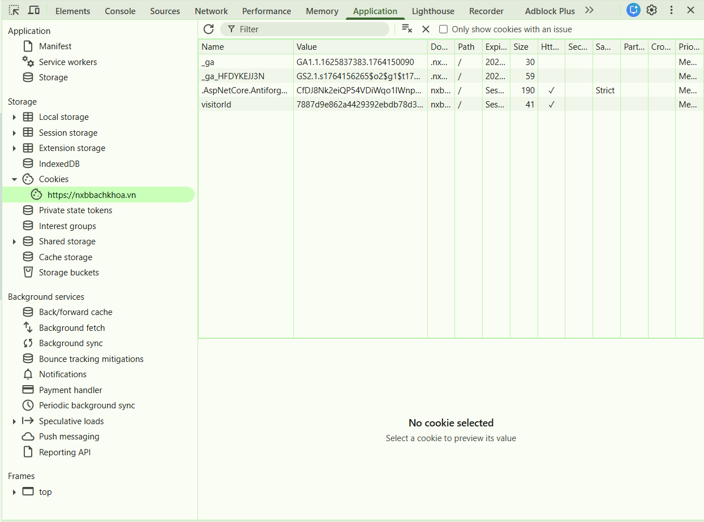
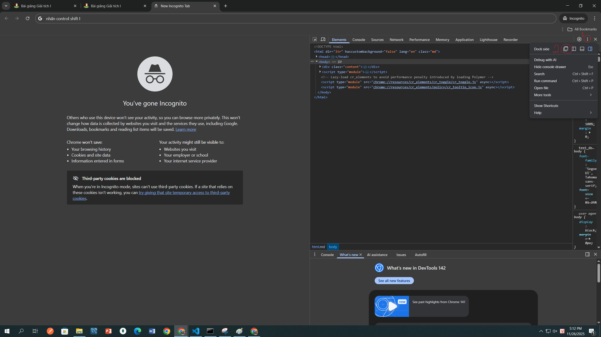

# Book Downloader and PDF Creator

This Python script downloads book pages as images from `nxbbachkhoa.vn` and merges them into a single PDF file.

## Features

- Downloads all pages of a book as JPG images
- Merges downloaded images into a single PDF file
- Configurable options for downloading and merging

## Prerequisites

Before running the script, you need to install the required Python packages:

```bash
pip install requests Pillow
```

## Setup Instructions

### Step 1: Get Authentication Cookies

You need to extract authentication cookies from your browser after logging into `nxbbachkhoa.vn`:



1. Open Developer Tools → Application → Cookies → `https://nxbbachkhoa.vn/`
2. Copy the values for each cookie:
   - `_ga`
   - `visitorId`
   - `.AspNetCore.Antiforgery.PAnxZgrQbk8`
   - `auth`
   - `_ga_HFDYKEJJ3N`

### Step 2: Find the Book URL (buoc_0.png)

Before you can download a book, you need to identify its base URL. Follow these steps:



1. Navigate to the book you want to download on `nxbbachkhoa.vn`
2. Open the book and go to the first page
3. Open Developer Tools in your browser (usually F12)
4. Go to the Network tab
5. Reload the page or go to the next page
6. Look for image requests in the Network tab
7. Identify the URL pattern for the book pages

### Step 3: Extract Base URL

From the image URLs you found in Step 2, extract the base URL:

- Example URL: `https://reading.nxbbachkhoa.vn/doc-sach/502b30d4-bf8e-41c2-a917-78701b9f2847/files/mobile/1.jpg?231108171815`
- Base URL: `https://reading.nxbbachkhoa.vn/doc-sach/502b30d4-bf8e-41c2-a917-78701b9f2847/files/mobile`
- Book ID (id_sach): `231108171815` (the part after the `?` in the image URL)

### Step 4: Watch the Tutorial Video

For a detailed walkthrough of the setup process, watch the tutorial video:

[Watch the tutorial video](./cach_lay_base_url.mp4)

## Configuration

Before running the script, you need to configure the following variables in [main.py](file:///d:/shub/hust/main.py):

1. **Authentication Cookies** (Lines 11-15):

   - Update these with the values you extracted from your browser

2. **Book Information** (Lines 5, 22-23):

   - `total_pages`: Total number of pages in the book
   - `base_url`: Base URL for the book images (extracted in Step 3 above)
   - `id_sach`: Book identifier (extracted in Step 3 above)

3. **Options** (Lines 7-8):

   - `download_images`: Set to `False` if you already have the images and only want to create PDF
   - `merge_to_pdf`: Enable/disable PDF creation

4. **Output Settings** (Lines 25-27):
   - `save_dir`: Directory to save downloaded images
   - `output_pdf`: Name of the output PDF file

## Usage

Run the script with Python:

```bash
python main.py
```

The script will:

1. Create a folder named `img` (or your configured [save_dir](file:///d:/shub/hust/save_dir))
2. Download all book pages as JPG images
3. Save images in the folder
4. Merge all images into a single PDF file

## Output

- Individual page images: Saved in the `img` folder
- Final PDF: Created in the same directory as the script with the name specified in [output_pdf](file:///d:/shub/hust/output_pdf)

## Troubleshooting

- If downloads fail, check your authentication cookies
- Make sure the `base_url` and `id_sach` are correct
- Ensure you have enough disk space for the images and PDF
- Check your internet connection if downloads are slow or failing

## License

This project is MIT licensed.

## Disclaimer

This script is intended for personal use only. Please respect copyright laws and the terms of service of `nxbbachkhoa.vn`.
